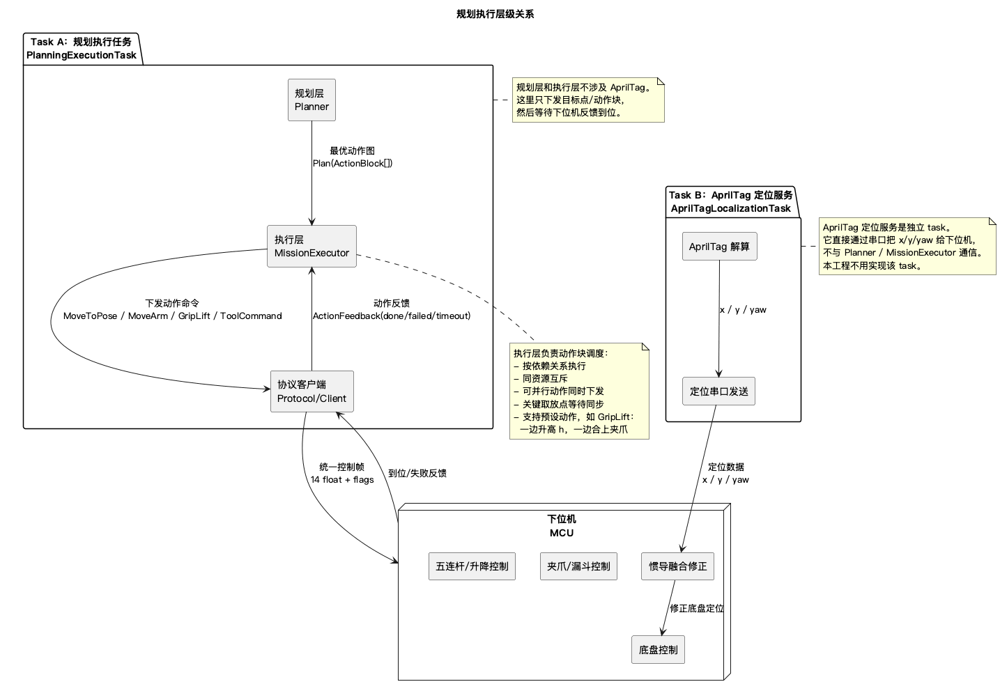
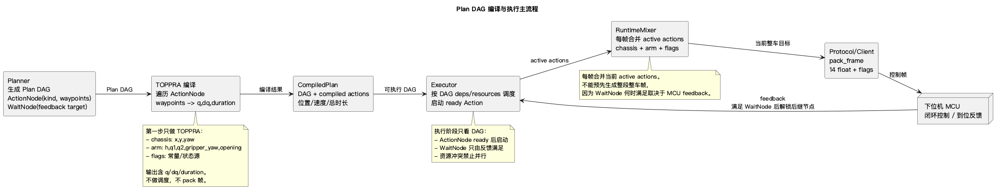

# 完整规划层与执行层设计

本文档定义规划执行 task 的边界。目标是在一趟比赛中，根据抽签结果生成最优动作块，并按动作块下发目标点、等待下位机反馈到位。

AprilTag 定位服务是另一个完全独立的 task：它通过串口把 AprilTag 解算得到的 `x/y/yaw` 发给下位机，下位机自动修正惯导。规划层和执行层不调用、不等待、不实现 AprilTag 逻辑。

## 1. 总体分层

层级关系 UML：



UML 源文件：`规划执行层级关系.puml`。

只看规划层和执行层内部关系：



UML 源文件：`plan_execute_toppra.puml`。

核心关系：

```text
Planner -> Motions -> TOPPRA compile -> Compiled DAG(ActionNode/WaitNode)
Executor -> DAG scheduling
RuntimeMixer -> RobotCommandState -> Protocol/Client -> 下位机
AprilTagLocalizationTask -> 下位机
```

两条 task 之间没有代码依赖。规划执行 task 只下发目标点/动作块并等待下位机反馈；AprilTag 定位 task 只负责把 `x/y/yaw` 发给下位机修正惯导。

边界原则：

- `Planner` 负责选“做什么、去哪、用哪个姿态”。
- `Motions` 属于 Planner 内部的小 motion 库，只负责为某个 `ActionNode` 生成 `AbstractGeometricPath`。
- `TOPPRA` 属于 Planner 内部流程，在 DAG 输出前完成。
- `Plan DAG` 负责动作间依赖和并行，节点分为 `ActionNode` 和 `WaitNode`。
- `MissionExecutor` 负责执行 DAG、启动 Action、等待 WaitNode 反馈条件满足。
- `ActionNode` 的业务载荷有且只有 `path: AbstractGeometricPath`；只能是 `chassis`、`arm` 或 `flags` 之一。`kind` 同时就是资源锁，不再单独定义 `resources`。
- `Executor` 不接触 TOPPRA，不编译 path，只执行已编译 DAG。
- `RuntimeMixer` 每个控制周期读取当前活跃 Action，按反馈状态采样并合并成当前 `RobotCommandState`。
- `Protocol/Client` 只负责把当前 `RobotCommandState` 打包成一帧并收反馈。
- 下位机负责底盘闭环、惯导修正、机构控制和到位反馈。
- `AprilTagLocalizationTask` 只负责把定位结果发给下位机；规划执行 task 不关心它。

## 2. 核心数据模型

### 2.1 RobotState

`RobotState` 是规划和执行之间的共享状态：

角度统一约定：`yaw/q1/q2/gripper_yaw/gripper_opening` 均为 rad。`yaw/q1/q2/gripper_yaw` 正方向均为逆时针；`q1/q2 = 0` 时主动臂指向机器人局部 `+y`。

```python
RobotState(
    x: float,
    y: float,
    yaw: float,
    h: float,
    q1: float,
    q2: float,
    gripper_yaw: float,
    gripper_opening: float,
    flags: int,
    cargo: CargoState,
    completed_pickups: set[int],
    completed_drops: set[int],
)
```

其中 `cargo` 表示三个携带位置：

```python
CargoState(
    upper_funnel: int | None,
    lower_funnel: int | None,
    gripper: int | None,
)
```

### 2.2 ActionNode 与 Planner 编译

`planner/motions.py` 不负责执行。它是 Planner 内部构建 `AbstractGeometricPath` 的小 motion 库。

Planner 在输出 DAG 前完成 TOPPRA。也就是说，Executor 收到的 `ActionNode.path` 已经是可直接按时间读取的 `AbstractGeometricPath`，不是待编译的 waypoints，也不是固定频率的 `q/dq` 数组字段。

例如 Planner 想创建一个底盘 ActionNode：

```python
path = motions.chassis_s_cross_half(current_state, x, y, yaw)
exec_path = toppra_planner.plan(path)
node = ActionNode(
    id="chassis_to_pickup",
    kind="chassis",
    deps=[],
    path=exec_path,
)
```

如果一个高级任务需要多个节点，由 Planner 负责创建多个 `ActionNode/WaitNode` 并连接依赖：

```text
Planner:
  path -> TOPPRA -> ActionNode(kind=chassis, path)
  path -> TOPPRA -> ActionNode(kind=arm,     path)
  WaitNode(target=chassis_reached(...))
  path -> TOPPRA -> ActionNode(kind=arm,     path)
```

注意：一个 `ActionNode` 只能是单一层：

```text
chassis_action：path 输出 x/y/yaw 与 dx/dy/dyaw
arm_action：path 输出 h/q1/q2/gripper_yaw/gripper_opening 与对应速度
flags_action：path 输出 flags 状态；不参与 TOPPRA 时也必须通过 path 表达
```

Plan 是 DAG，不是顺序列表。DAG 里有两类节点：

```text
ActionNode：启动一段已经 TOPPRA 编译好的单层动作，占用对应 `kind` 资源。
WaitNode：等待下位机反馈满足条件，本身不发轨迹。
```

ActionNode：

```python
ActionNode(
    id: str,
    kind: "chassis" | "arm" | "flags",
    deps: list[str],
    path: AbstractGeometricPath,
)
```

`AbstractGeometricPath` 是 Planner 和 Executor 的唯一轨迹契约：

```python
AbstractGeometricPath(
    duration: float,
    q(t: float) -> np.ndarray,
    dq(t: float) -> np.ndarray,
)
```

WaitNode：

```python
WaitNode(
    id: str,
    deps: list[str],
    target: FeedbackTarget,
    timeout: float,
)
```

`deps` 依赖的是 node id。`WaitNode` 不是串在某个 `ActionNode` 后面的“空动作”，而是一个反馈门控节点：它可以和 `ActionNode` 依赖同一个前置节点并同时启动。后续节点只依赖 `WaitNode`，表示“反馈条件满足后即可接入”。`WaitNode` 必须由下位机反馈触发。

`kind` 同时表示该节点占用的资源：

```text
kind=chassis：占用底盘 x/y/yaw 控制。
kind=arm：占用 h/q1/q2/gripper_yaw/gripper_opening 控制。
kind=flags：占用 flags 控制，包括夹爪使能、上漏斗、下漏斗。
```

例子：

```text
Action A: chassis_move_to_mid
  deps=[start]
  kind=chassis
  path=compiled chassis path

Wait W: wait_mid_reached
  deps=[start]
  target=chassis_reached(mid_pose)

Action B: arm_prepose
  kind=arm
  deps=[W]
  path=compiled arm path
```

这表达的是：A 和 W 在 `start` 完成后同时启动；W 一直看 MCU 反馈。只要 MCU 反馈底盘到达 `mid_pose`，B 就可以启动。此时 A 是否还在运行不重要，A 和 B 能不能同时运行只由 `kind` 锁决定。

### 2.3 Plan

```python
Plan(
    id: str,
    nodes: list[ActionNode | WaitNode],
    estimated_time: float,
    pickup_order: list[int],
    drop_order: list[int],
    container_assignment: dict[int, str],
)
```

Plan 的并行由 DAG deps 和 `ActionNode.kind` 决定。

## 3. 规划层设计

### 3.1 Planner 输入

```python
PlanningInput(
    pickup_assignment: list[int],
    drop_assignment: list[int],
    current_state: RobotState,
    remaining_tasks: RemainingTasks,
)
```

`pickup_assignment` 长度为 3，表示取货位 1-3 分别是什么豆子。`drop_assignment` 长度为 5，表示放置位 4-8 分别是什么编号货箱。

### 3.2 Planner 输出

Planner 必须一次确定：

- 三种豆子的容器分配：上漏斗、下漏斗、夹爪。
- 取货顺序。
- 放货顺序。
- 每个取放动作的底盘停车姿态。
- 每个夹爪动作的 `h/q1/q2/gripper_yaw/gripper_opening`。
- 每个漏斗动作的底盘姿态和漏斗门动作。
- 跨场 S 型动作的起点、终点和结束 yaw。
- 完成后的停车姿态。
- 动作依赖和 `kind` 占用。

### 3.3 候选生成

Planner 按以下顺序生成候选：

```text
1. 根据 drop_assignment 得到 bean -> target_drop_position
2. 枚举 3! 种 bean -> carrier 分配
3. 为每个目标放置位查询 candidate_poses
4. 为每个取货位查询 pickup candidate_poses
5. 枚举取货顺序
6. 枚举放货顺序
7. 生成跨场动作
8. 生成完整 Plan DAG
9. 调度估时并评分
10. 选择 score 最小的 Plan
```

### 3.4 几何查询

规划层使用 `planning_geometry.py` 做几何判断：

- 底盘是否在场地内。
- 底盘是否撞取货台、放置箱、障碍柱。
- 夹爪是否覆盖目标矩形。
- 夹爪开口方向是否能平行于目标箱边缘。
- 取豆时是否能生成 `h` 上升和 `gripper_opening` 关闭的同步动作段。
- 五连杆是否可达。
- 漏斗出口是否能贴近目标箱。

### 3.5 评分

第一版评分：

```text
score = scheduled_time
```

完整评分：

```text
score = scheduled_time
      + collision_risk_penalty
      + yaw_switch_penalty
```

其中 `scheduled_time` 由动作图调度得到，不是简单把所有动作相加。底盘移动和 arm 预备动作可以并行。

## 4. 执行层设计

### 4.0 当前代码目录

轨迹和运动学不要堆在单个文件里，当前按职责拆成：

```text
arm/
  types.py          五连杆参数、IK/FK 解、异常类型、ArmWaypoint，继承自 trajectory 抽象 Waypoint
  five_bar.py       五连杆正逆运动学，负责连续 IK 解选择
  toppra_planner.py ArmWaypoint list TOPPRA 时间参数化，返回 AbstractGeometricPath

chassis/
  types.py          底盘参数、异常类型、ChassisWaypoint，继承自 trajectory 抽象 Waypoint
  toppra_planner.py ChassisWaypoint list TOPPRA 时间参数化，返回 AbstractGeometricPath

trajectory/
  types.py          抽象 Waypoint、异常类型
  densify.py        线性插值加密、source 边界识别、路径 s 计算
  smoothing.py      B 样条倒角窗口查找与平滑
  toppra_planner.py 抽象 TOPPRA 时间参数化骨架，返回 AbstractGeometricPath

plan/
  types.py          AbstractGeometricPath、AbstractNode、ActionNode、WaitNode、FeedbackTarget
  dag.py            DAG / children / dep_left 等调度需要的图结构

planner/
  motions.py        预设动作库，为单个 ActionNode 生成 AbstractGeometricPath

executor/
  executor.py       执行 DAG，管理 active Action 和 active Wait

connection/
  client.py         串口/websocket 发送与反馈解析，不 import trajectory
  protocol.py       14 float + flags 二进制协议
```

热路径注意事项：

- Planner 输出 DAG 前完成 TOPPRA，ActionNode 已携带 `AbstractGeometricPath`。
- `RuntimeMixer` 每一帧从当前活跃 Action 采样并合成当前 `RobotCommandState`。
- `Client` 只读取当前 `RobotCommandState` 生成一帧，不认识 TOPPRA。
- arm 末端路径使用 `Nx2` 数组，连续 IK 使用 `ik_path()`，不在采样路径里批量创建点对象。

模块依赖方向必须保持单向：

```text
planner -> plan + arm + chassis
planner/motions.py -> arm + chassis + trajectory
arm -> trajectory + plan
chassis -> trajectory + plan
trajectory -> plan
executor -> plan + connection
connection/client.py -> connection/protocol.py
connection/protocol.py -> 无业务依赖
```

禁止反向依赖：

```text
plan 不允许 import planner / executor / connection
connection 不允许 import planner / executor / trajectory
executor 不允许 import planner / motions / arm / chassis / toppra
planner 不允许 import executor / connection
```

### 4.1 Planner 内部路径与 TOPPRA

Planner 创建 `ActionNode` 时，先调用小 motion 函数得到几何路径，再在 Planner 内部做 TOPPRA，最后把可按时间读取的 `AbstractGeometricPath` 写入 `ActionNode.path`。

几何路径可以来自：

```text
chassis_direct_to(x, y, yaw)
chassis_s_cross_half(x, y, yaw)
arm_direct_to(...)
arm_cross_half_plane(...)
```

`ActionNode.path` 输出维度由 `ActionNode.kind` 决定：

```text
kind=chassis: q = (x, y, yaw)
kind=arm:     q = (h, q1, q2, gripper_yaw, gripper_opening)
kind=flags:   q(t) 输出 flags 状态
```

需要“底盘到位后再开漏斗”时，不在 motion 内拆 stage，而是在 DAG 里放一个和底盘 Action 同步启动的 WaitNode：

```text
Action A: move_to_drop_pose
  deps=[start]

Wait W: wait_drop_pose_reached
  deps=[start]

Action B: open_upper_funnel, deps=[W]
```

`W` 必须由 MCU 反馈满足，不能由 A 的发送进度或轨迹结束满足。

### 4.2 Executor 执行

Executor 收到的是已编译 DAG：

```python
ActionNode(
    id: str,
    kind: "chassis" | "arm" | "flags",
    deps: list[str],
    path: AbstractGeometricPath,
)
```

```text
1. 找 deps 已满足的 WaitNode，启动反馈等待
2. 找 deps 已满足、对应 `kind` 空闲的 ActionNode，启动对应 ActionNode
3. 每个控制周期读取 feedback
4. 用 feedback 判断 active WaitNode 是否满足
5. RuntimeMixer 每帧合并 active ActionNode
6. pack_frame 并发送当前帧
7. Action 完成后释放 `kind` 锁；WaitNode 满足后解锁后继节点
```

执行阶段不能提前合成整段整车帧，因为哪些 Action 会在什么时候接入，取决于 WaitNode 何时被 MCU feedback 满足。

### 4.3 并行规则

并行只由 DAG deps 和 `ActionNode.kind` 决定。

允许并行：

- 底盘移动时，arm 去安全位或预备位。
- 跨场移动时，arm 收回。
- 漏斗门关闭状态下，底盘移动。

禁止并行：

- 底盘未反馈到精确停车点时执行取货或放货。
- 底盘移动时夹爪伸入目标箱区域。
- 同一个 `kind` 同时只能执行一个动作。
- 漏斗门打开时执行底盘移动。

夹爪取货特例：

- 底盘停稳后，允许 `h` 上升与 `gripper_opening` 关闭同步执行。
- 该同步动作属于 `kind=arm`，因为 `gripper_opening` 是 arm 轨迹的一维。
- 同步动作必须从已对齐的 `gripper_yaw` 开始，不能一边旋转夹爪一边插入箱体。

### 4.4 动作完成条件

WaitNode 完成：

- 下位机反馈满足 `FeedbackTarget`。
- 例如底盘姿态满足 `tolerance_xy/tolerance_yaw`。
- 未超时。

ActionNode 完成：

- 轨迹源输出结束。
- ActionNode 自身不代表“到位”，到位必须由 WaitNode 表达。

取货动作完成：

- 夹爪吸附成功，或货物进入指定漏斗。
- `CargoState` 更新。

放货动作完成：

- 对应容器清空。
- 目标豆子的 drop task 标记完成。

## 5. 下发与反馈协议

### 5.1 运行时下发

Executor 使用 Planner 输出的 Plan DAG。每个 Action 只有一个 `AbstractGeometricPath`：

```python
ActionNode(
    id: str,
    kind: "chassis" | "arm" | "flags",
    deps: list[str],
    path: AbstractGeometricPath,
)
```

控制循环每一帧执行：

```text
1. 接收 MCU feedback，更新当前真实/估计状态
2. 根据 feedback 判断 WaitNode 是否完成
3. 根据 DAG 解锁新的 ActionNode
4. 对当前活跃 ActionNode 调用 path.q(t) / path.dq(t)
5. RuntimeMixer 合并 chassis / arm / flags
6. pack_frame 并发送一帧
```

不能预先把多个 action 合成为一条长整车帧流，原因是：某个 WaitNode 何时满足取决于 MCU 反馈，不取决于上位机发送到第几帧。

### 5.2 统一控制帧

Protocol/Client 每个控制周期从当前 `RobotCommandState` 打包底层帧：

```text
SOF(0xAA55) + 14 * float32 + uint8 flags
```

字段：

```text
x, y, yaw,
h, q1, q2, gripper_yaw, gripper_opening,
dx, dy, dyaw,
dh, dq1, dq2,
flags
```

`flags`：

- `bit0`：夹爪使能/吸附状态。夹爪开合角由 `gripper_opening` 连续控制，不再用 bit0 表达开合角。
- `bit1`：上漏斗门打开。
- `bit2`：下漏斗门打开。

`gripper_yaw/gripper_opening` 不单独增加速度前馈字段。它们的速度限制由 `MotionCompiler` 中 arm TOPPRA 的维度约束和下位机内部限速共同处理。

flags 的时序规则：

- flags 不参与 TOPPRA。
- flags 来自当前活跃 Action 的 flags source。
- 如果 flags 必须等底盘到位后改变，必须让 flags Action 依赖对应 WaitNode。
- flags 改变不能由“上位机已发送完某段帧”触发，只能由 WaitNode 反馈条件触发。

### 5.3 Feedback

反馈不直接表示“上位机发完”。反馈用于判断 WaitNode 是否满足：

```python
Feedback(
    current_state: RobotState,
    status: int,
    error: int,
)
```

WaitNode 内部的 `FeedbackTarget` 负责判断反馈是否满足：

```python
FeedbackTarget(
    kind: str,       # chassis_pose / arm_pose / flag_state / cargo_state
    value: tuple,
    tolerance: tuple,
)
```

Planner 不直接消费底层反馈；Executor 用反馈推进 DAG。

## 6. 失败与重规划

可恢复失败：

- 底盘 fine move 超时。
- arm 到位误差超限。
- 夹爪吸附失败。
- 夹爪 yaw 对齐失败。
- 夹爪合爪上升同步动作超时。
- 漏斗放料未确认。

处理策略：

```text
1. WaitNode 超时或反馈 failed
2. MissionExecutor 停止相关 active Action
3. 判断是否能执行 recovery Plan
4. recovery 后仍失败，则以 current_state + remaining_tasks 调 Planner.replan
```

不可恢复失败：

- 撞倒障碍物。
- 推倒货箱。
- 货物严重混装。
- 下位机失联。
- 急停触发。

不可恢复失败直接停止执行，并保留当前成绩状态。

## 7. 比赛核心循环

完整比赛按以下节奏运行：

```text
1. 读取抽签结果
2. 构造 PlanningInput
3. Planner 生成完整 Plan
4. MissionExecutor 执行 Plan DAG
5. ActionNode ready 后启动 trajectory source
6. 每个控制周期 RuntimeMixer 合并当前活跃 Action 并发送一帧
7. WaitNode 根据 MCU feedback 满足后解锁后继节点
8. 每个等待点完成后更新 RobotState 和 CargoState
9. 失败或超时后恢复/重规划
10. 三种货物完成后执行 FinishPose
11. 停车并示意完成
```

一趟标准动作结构：

```text
arm_stow
pickup_move_1 + arm_prepose_1
pickup_1
load_to_container_1

pickup_move_2 + arm_prepose_2
pickup_2
load_to_container_2

pickup_move_3 + arm_prepose_3
pickup_3

s_move_to_drop_zone + arm_stow

drop_move_1 + arm_prepose/drop_prepare_1
drop_1

drop_move_2 + arm_prepose/drop_prepare_2
drop_2

drop_move_3 + arm_prepose/drop_prepare_3
drop_3

finish_move
```

实际顺序由 Planner 枚举选择，不固定写死。

## 8. 测试场景

规划层测试：

- 抽签输入能正确生成 `bean -> pickup_pos` 和 `bean -> drop_pos`。
- 三种容器分配均能枚举。
- 不可达夹爪姿态被过滤。
- 撞障碍或压箱的底盘姿态被过滤。
- Plan 中每个动作都有 `kind`、依赖和预计时间。
- Plan DAG 同时包含 ActionNode 和 WaitNode。
- 需要反馈确认的位置必须建 WaitNode，不能用发送进度替代。
- 生成的 Plan 必须包含完成停车动作。

执行层测试：

- 依赖未完成时不会下发后续动作。
- `chassis` 和 `arm` 可并行执行不同动作。
- 同一 `kind` 不会被两个动作同时占用。
- WaitNode 未满足时不会启动后继 ActionNode。
- WaitNode 满足后能解锁后继 ActionNode。
- RuntimeMixer 每一帧按当前 active actions 合并，不预生成长整车帧。
- `timeout/failed` 能停止相关 active actions 并进入 recovery 或 replan。

协议测试：

- 当前 `RobotCommandState` 能打包成当前二进制帧。
- flags bit0/bit1/bit2 与夹爪使能、上漏斗、下漏斗一致。
- 非法 `h/q1/q2/gripper_yaw/gripper_opening/flags` 会被拒绝。

## 9. 当前落地顺序

建议按以下顺序实现：

```text
1. 在 plan/types.py 定义 AbstractGeometricPath / AbstractNode / ActionNode / WaitNode / FeedbackTarget
2. 在 plan/dag.py 定义 DAG、children、dep_left 等调度辅助结构
3. 在 trajectory/types.py 定义抽象 Waypoint 和异常类型
4. 在 arm/types.py、chassis/types.py 定义各自 Waypoint
5. 在 arm/toppra_planner.py、chassis/toppra_planner.py 实现各自 TOPPRA，返回 AbstractGeometricPath
6. 在 planner/motions.py 定义小 motion 函数，生成单个 ActionNode.path
7. 在 executor/executor.py 实现 DAG 调度、active actions、active waits
8. 在 executor 内实现 RuntimeMixer，每帧合并 active actions 为 RobotCommandState
9. connection/client.py 只发送单帧 RobotCommandState，不接收预生成整车帧流
```

实现时保持一个原则：

```text
Planner 不下发帧。
Executor 不做几何枚举。
Executor 不调用 planner/motions。
Motions 只在 Planner 内部生成 ActionNode.path。
RuntimeMixer 不决定任务顺序，只合并当前 active actions。
WaitNode 只能由下位机反馈触发，不能由发送进度触发。
AprilTag 定位服务不进入 Planner/Executor。
下位机不决定任务顺序。
```
